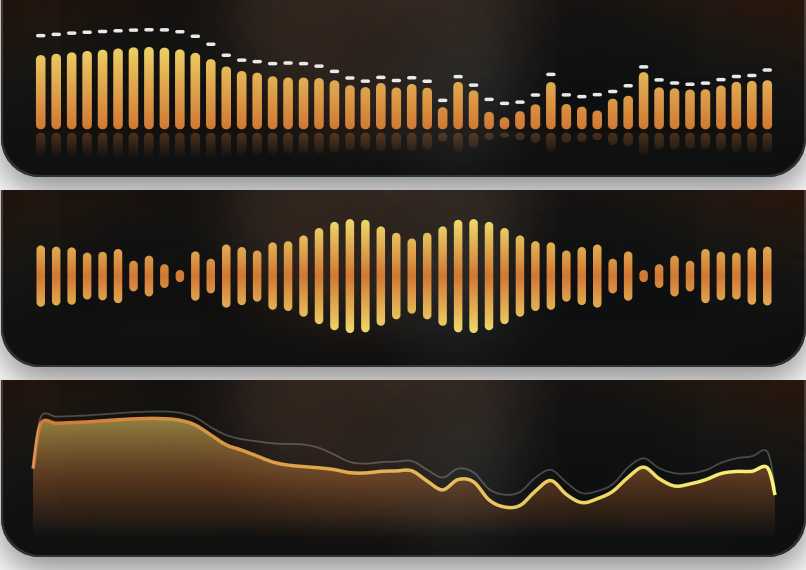

# SpectrumWidget

一个 Windows 桌面音乐小部件：显示当前正在播放的歌曲（封面、标题、歌手、进度）和实时频谱。

> **自用项目。** 写给自己日常用的，按我自己的习惯和机器环境做的，不保证在别的环境下都能用，也不打算长期维护或接受功能需求。代码随便看、随便改，按 [MIT 许可证](LICENSE) 发布。



## 功能

**正在播放**
- 显示任意播放器的歌曲信息：封面、标题、歌手、专辑、来源 App（Spotify、浏览器、系统媒体播放器、QQ 音乐等接入系统媒体控件的播放器）
- 进度条（支持点击跳转）、上一首 / 播放暂停 / 下一首
- 多个播放器同时存在时优先跟随正在播放的那个，不来回跳

**频谱**
- 实时分析系统声音输出，任何程序放的声音都能显示
- 三种样式：柱状（带倒影和下落峰值帽）/ 镜像 / 平滑波形
- 自动增益：系统音量小的时候频谱也能跳满
- 切换耳机 / 音箱等默认输出设备后自动重连

**外观**
- 模糊封面氛围背景，频谱配色从封面自动取色，切歌时平滑过渡
- 大小、背景不透明度、频段数量可调

**桌面小部件**
- 无边框、可拖动，位置自动记住；不占任务栏，不出现在 Alt+Tab
- 收起成小圆片：卡片右上角的收起按钮或全局快捷键 **Ctrl+Alt+M**。小圆片是转动的黑胶封面 + 迷你频谱，单击展开，可拖动；收起 / 展开时贴着靠近屏幕角落的那一角
- 自动收起：没在播放时收起成小圆片，开始播放时自动展开
- 全屏隐藏：有全屏程序（游戏、全屏视频）时完全隐藏，退出全屏后回来
- 托盘图标：左键完全隐藏 / 显示，右键打开菜单
- 置顶、锁定位置、鼠标穿透、开机自启

右键菜单（小部件上或托盘图标上都行）：

| 选项 | 说明 |
| --- | --- |
| 始终置顶 | 默认关闭，关闭时就是普通的桌面小部件，会被窗口盖住 |
| 收起 / 展开 | 同 Ctrl+Alt+M |
| 完全隐藏 / 显示 | 同单击托盘图标 |
| 自动收起 / 隐藏 | 没在播放时收起（可选 3 秒 / 10 秒 / 30 秒 / 1 分钟后）、有全屏程序 / 游戏时完全隐藏，两项可单独开关 |
| 锁定位置 | 防止误拖 |
| 鼠标穿透 | 点击直接穿过小部件；开启后只能从托盘菜单关掉 |
| 频谱样式 | 柱状 / 镜像 / 波形（也可以双击频谱区切换） |
| 频段数量 | 32 / 48 / 64 / 96 |
| 大小 | 75% – 150% |
| 背景不透明度 | 40% – 100% |
| 开机自启 | 写入 `HKCU\...\Run` |

## 运行环境

- Windows 10 2004（19041）及以上，主要在 Windows 11 上用
- [.NET 7 桌面运行时](https://dotnet.microsoft.com/download/dotnet/7.0)（自己编译的话需要 .NET 7 SDK 或更新）

## 编译 / 运行

```bash
git clone https://github.com/jxa94/SpectrumWidget.git
cd SpectrumWidget
dotnet build -c Release
```

生成的程序在 `bin/Release/net7.0-windows10.0.19041.0/SpectrumWidget.exe`，双击运行即可，同一时间只会开一个。

想要一个不依赖运行时的单文件：

```bash
dotnet publish -c Release -r win-x64 --self-contained true -p:PublishSingleFile=true
```

## 配置文件

设置和错误日志都在 `%APPDATA%\SpectrumWidget\`：

- `settings.json`：位置、置顶、样式、大小等，都能在右键菜单里改，一般不用手动编辑
- `error.log`：出错时写在这里

## 代码结构

| 文件 | 作用 |
| --- | --- |
| `AudioCapture.cs` | WASAPI 环回采集、4096 点 Hann 窗 FFT、对数频段映射、+3 dB/倍频程倾斜补偿、自动增益 |
| `SpectrumView.cs` | 频谱绘制（三种样式）、上升/下落平滑、峰值帽物理、配色过渡 |
| `MediaWatcher.cs` | SMTC 会话选择与事件监听、播放器名称美化 |
| `ColorUtil.cs` | 从封面按色相直方图取主色 / 辅色 |
| `MainWindow.xaml(.cs)` | 界面、拖动、进度插值、控制按钮、右键菜单、Win32 窗口样式 |
| `TrayIcon.cs` | 托盘图标 |

依赖只有 [NAudio.Wasapi](https://github.com/naudio/NAudio)。

## 已知限制

- 有的播放器没接入 SMTC，或者只接了一部分（比如不给封面、不给进度），那就显示不了对应的信息。
- 进度靠播放器上报的时间线再在本地插值，个别播放器上报不准时进度会有偏差。
- "没在播放"的判断是：播放器没在播放，并且系统没有任何声音输出。所以别的程序出声（比如视频、提示音）也会让它出现。
- Ctrl+Alt+M 如果被别的程序占用了就注册不上，会记在 error.log 里，这时用右键菜单收起 / 展开。
- 频谱反映的是整个系统的声音输出，其他程序的声音（通知音、视频等）也会算进去。

## 许可证

[MIT](LICENSE)
